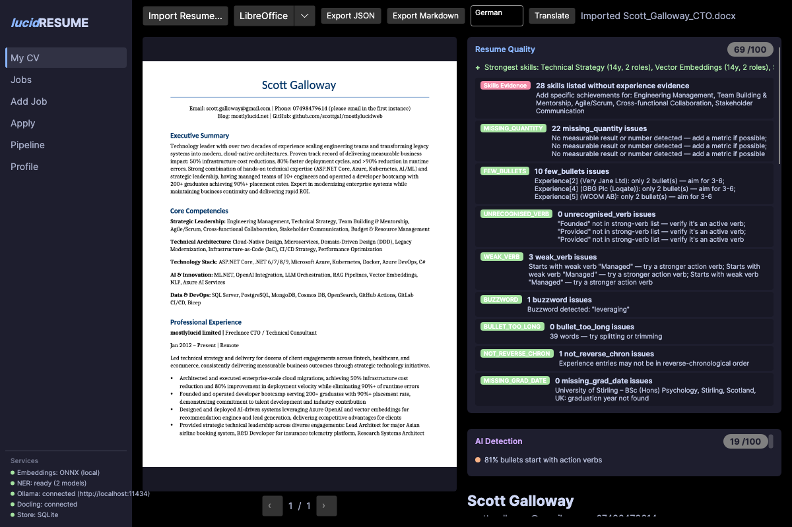
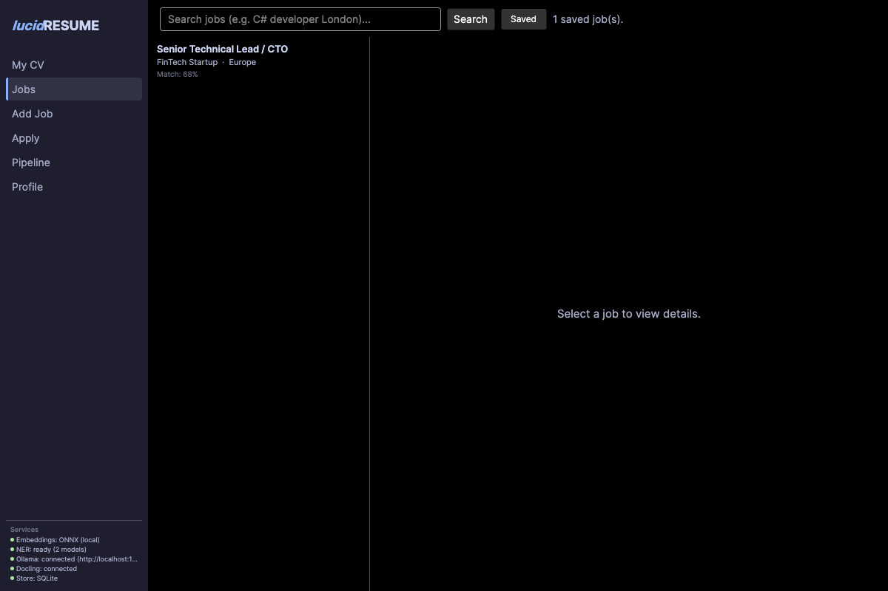
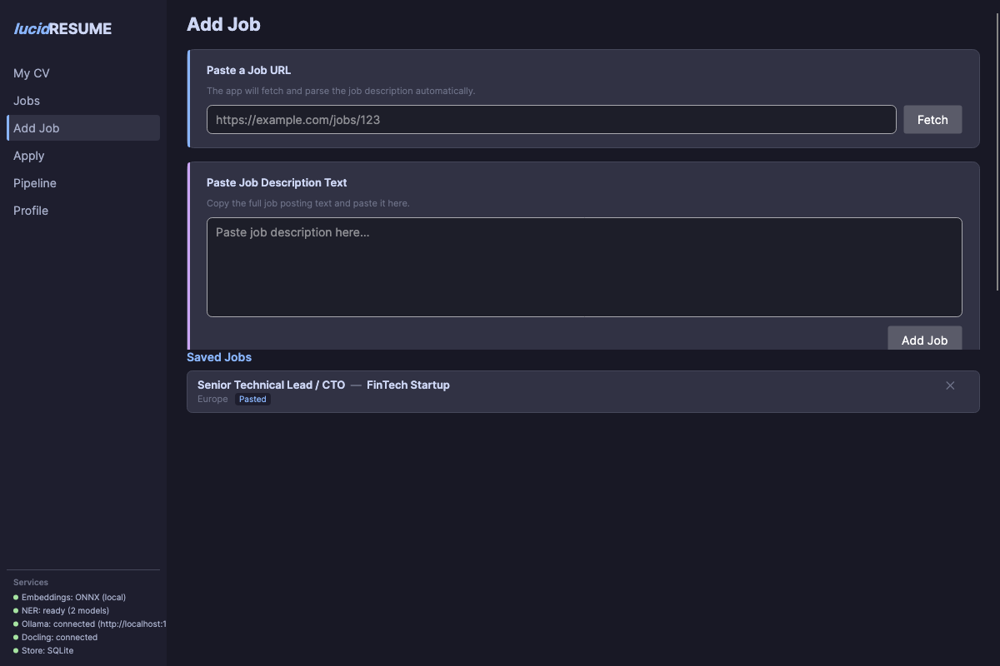
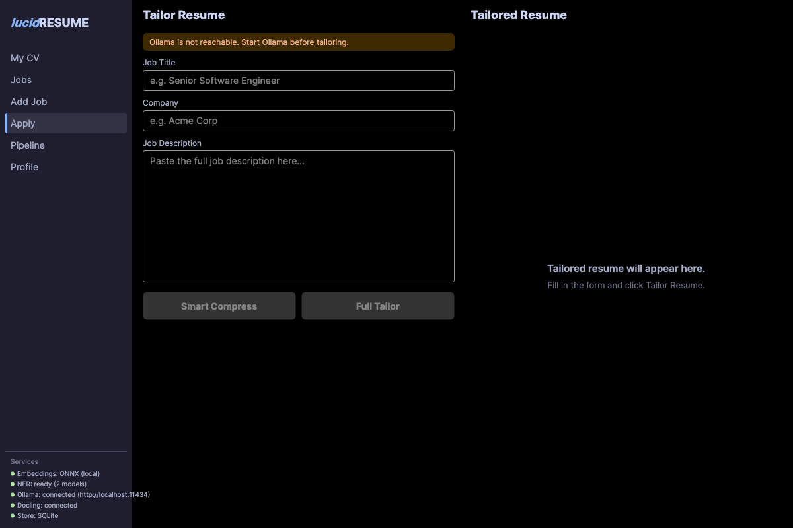
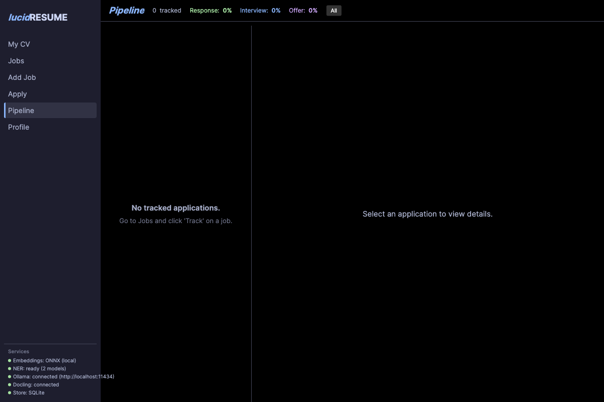
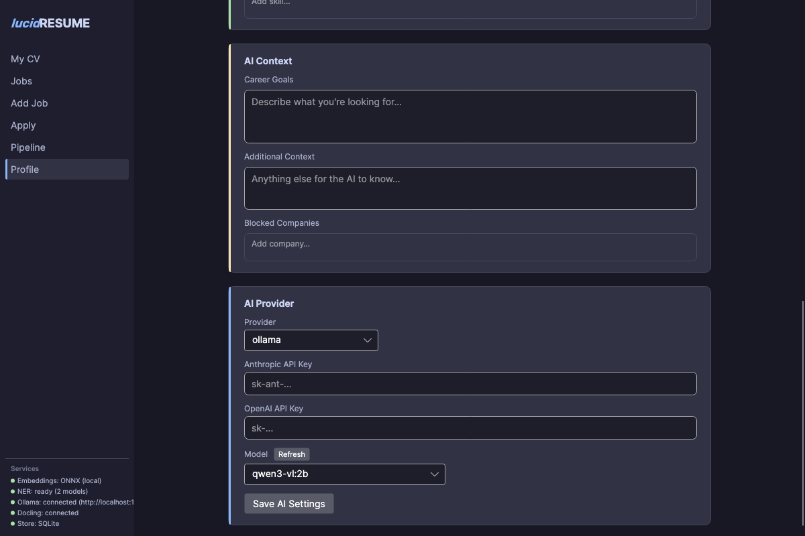
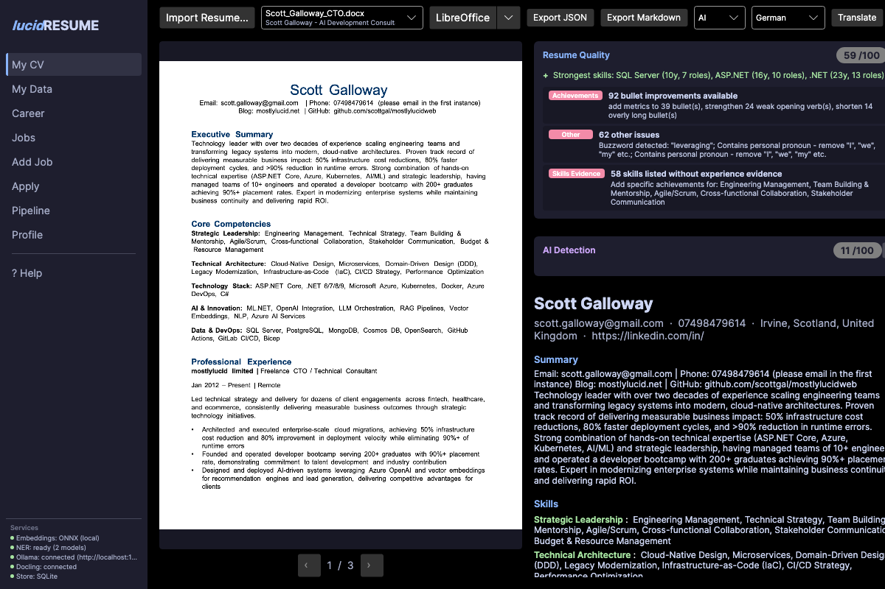
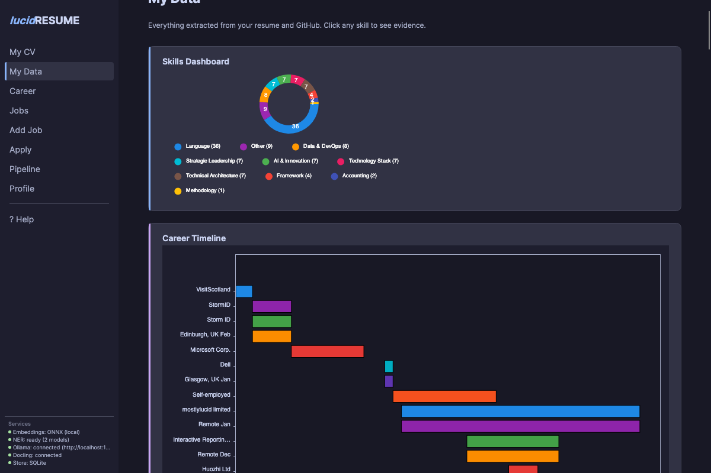
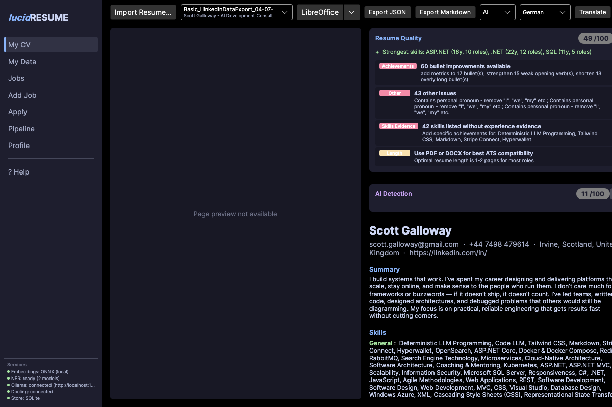
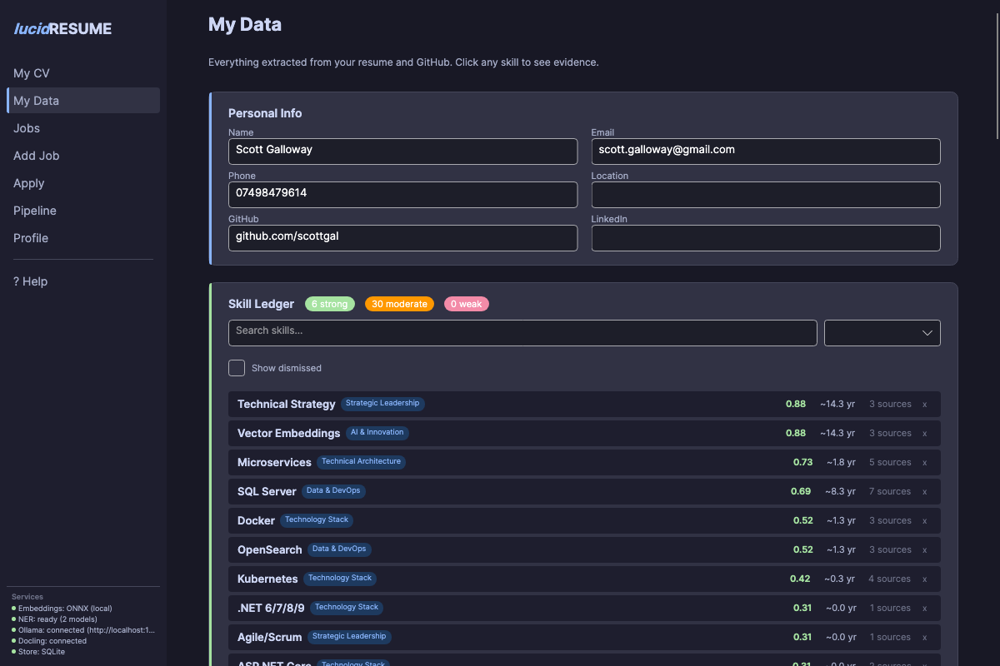

# ***lucid*RESUME**

**Your job search. Your data. Your machine.**

***lucid*RESUME** is a free, open-source desktop app that builds a structured, evidence-based model of your skills from your actual work - then uses it to:

- **Tailor resumes** to specific job descriptions
- **Match you to relevant roles** with per-skill similarity scoring
- **Show what you're missing** (and what you're not)
- **Plan your next move** based on your actual skill graph

Everything runs locally on your machine. No accounts. No data leaving your device unless you choose to.

> Built with .NET 10 + Avalonia. Runs on Windows, macOS, and Linux.

---

## Core Idea

**Every skill is backed by evidence.**

***lucid*RESUME** doesn't just list what you *say* you know - it builds a **skill ledger** where each skill is tied to:

- **Where** it appeared (job, project, repo)
- **When** you used it (date ranges, calculated years)
- **How often** it shows up across roles
- **How strong** the evidence is (recency, frequency, confidence)

No invented skills. No guessing. Just structured inference over your actual work.

This is the foundation everything else builds on - matching, tailoring, gap analysis, career direction.

---

## Screenshots

| Resume Import | Jobs & Matching |
|--------------|-----------------|
|  |  |

| Add Job | Apply & Tailor |
|---------|---------------|
|  |  |

| Pipeline (ATS) | Profile & AI Settings |
|----------------|----------------------|
|  |  |

| DOCX Preview (Morph) | My Data — Skill Ledger |
|---------------------|----------------------|
|  |  |

| My Data — Skills & Experience | LinkedIn Import |
|-------------------------------|----------------|
|  |  |

| LinkedIn → My Data |
|--------------------|
|  |

---

## Why ***lucid*RESUME**?

Every major job site wants your email, your browsing history, and permission to sell your profile. AI resume tools send your CV to some SaaS vendor's cloud. Paid tools charge monthly for table-stakes features.

***lucid*RESUME** does things differently:

- **Local-first AI** - tailoring runs through [Ollama](https://ollama.ai) on your hardware. Or use Anthropic/OpenAI APIs if you prefer.
- **No account required** - data stored in a local SQLite database. You own it.
- **Honest tailoring** - the AI never invents skills or experience you don't have.
- **Career direction (based on your actual skill graph)** - not just "match this job" but "what to do next to reach your target cluster".
- **Free forever** - Unlicense. Public domain.

---

## What It Does

### Resume Import
- **Drag and drop** any file onto the app to import — resumes, LinkedIn exports, anything
- Import PDF or DOCX resumes
- **DOCX preview** powered by [Morph](https://github.com/SimonCropp/Morph) — cross-platform document-to-image rendering in pure C#, no LibreOffice needed
- **LinkedIn data export** — drop your LinkedIn ZIP archive and it auto-detects and imports your full profile: positions, skills (with endorsement counts), education, projects, contact info
- Handles two-column, LaTeX, complex formatting
- Template learning: learns your resume's structure on first parse, deterministic on subsequent imports
- Multilingual: German, French, Spanish, Portuguese, Chinese, Dutch, Japanese, Korean

### Skill Ledger
- **Provenance chain**: skill -> which job -> which date range -> which bullet point
- **Calculated years**: sum of non-overlapping date ranges where the skill appears
- **Evidence strength**: combining years, role count, recency, confidence
- **Consistency checking**: flags skills listed but never demonstrated, claimed vs calculated years
- **Presentation gap vs true gap**: "you have adjacent skills" vs "you don't have this at all"

### Smart Matching
- Multi-vector cosine similarity between resume and JD skill ledgers
- 3-layer matching: substring -> embedding similarity -> achievement-text keyword search
- Per-skill match detail with similarity scores, evidence strength, calculated years

### Career Direction
- **Skill graph** with co-occurrence edges and Leiden community detection
- **Career planner**: 4 gap types (PresentationGap, WeakEvidence, AdjacentSkill, TrueGap)
- **Effort/impact ranking**: Low (rewording), Medium (side project), High (new learning)
- **Search query generator**: suggests job searches from your strongest skill communities

### AI Tailoring
- Rewrites resume for specific JDs using skill ledger evidence (not hallucination)
- Semantic compression: 13 roles -> 6 relevant -> filtered to evidence-backed bullets
- AI detection scorer (5 signals) + de-AI rewrite button
- Translation with sliding context and glossary

### Personal ATS (Pipeline)
- **Stage pipeline**: Saved -> Applied -> Screening -> Interview -> Offer -> Accepted/Rejected/Withdrawn/Ghosted
- Timeline per application, funnel visualization, stale detection
- **Email integration** (IMAP via MailKit): auto-detects confirmations, interviews, rejections, offers

### Job Search
Seven job board adapters searched in parallel (Adzuna, Reed, Findwork, Arbeitnow, JoinRise, Jobicy, Remotive). Near-duplicate detection via embedding similarity. Hoover role flagging.

### Export
JSON Resume (standard schema), Markdown, **DOCX** (Word via OpenXml), and **PDF** ([QuestPDF](https://www.questpdf.com/) — professional formatting, cross-platform).

### Documentation
- [Release & Archive Guide](docs/release.md) - release workflow, platform archives, and single-page docs archive.
- [Technical Architecture](docs/architecture.md) - modules, data flow, persistence, and extraction pipeline.
- [In-App User Manual](src/lucidRESUME/Resources/user-manual.md) - the same help content embedded in the desktop app.

---

## Getting Started

### Download & Install

1. Go to the [latest release](https://github.com/scottgal/lucidRESUME/releases/latest)
2. Download the archive for your platform:

| Platform | Download |
|----------|----------|
| **Windows** | `lucidRESUME-...-win-x64.zip` or `win-arm64.zip` |
| **macOS** | `lucidRESUME-...-osx-arm64.tar.gz` (Apple Silicon) or `osx-x64.tar.gz` (Intel) |
| **Linux** | `lucidRESUME-...-linux-x64.tar.gz` or `linux-arm64.tar.gz` |

3. Extract and run `lucidRESUME` (or `lucidRESUME.exe` on Windows)

That's it. ONNX models (~600MB) are downloaded automatically on first launch. No accounts, no setup wizards.

> **macOS users:** if Gatekeeper blocks the app, right-click → Open, or run `xattr -cr lucidRESUME.app` from Terminal.

### AI Tailoring (Optional)

AI tailoring is optional — everything else works without it.

**Option 1: Local AI with [Ollama](https://ollama.ai) (recommended)**
1. Install Ollama
2. Pull a model: `ollama pull qwen3.5:4b`
3. That's it — lucidRESUME connects to `localhost:11434` automatically

**Option 2: Cloud AI (Anthropic or OpenAI)**
1. Open the **Profile** page in the app
2. Enter your API key and select the provider

### Build from Source

For developers who want to build from source:

```bash
git clone https://github.com/scottgal/lucidRESUME
cd lucidRESUME
dotnet run --project src/lucidRESUME/lucidRESUME.csproj
```

Requires [.NET 10 SDK](https://dotnet.microsoft.com/download). See [docs/release.md](docs/release.md) for the release workflow.

---

## How It Works (Technical)

### Extraction

**Multi-signal RRF fusion**: structural analysis + ONNX NER (2 models: `dslim/bert-base-NER` + `yashpwr/resume-ner-bert-v2`) + LLM recovery + regex patterns - all run in parallel, fused by reciprocal rank fusion. Same pattern for both resume and JD extraction.

ONNX embeddings (`all-MiniLM-L6-v2`, 384-dim) power semantic matching throughout. Docling (Docker) adds ML-based PDF layout detection for complex documents; PdfPig with column detection as local fallback.

### Architecture

```
lucidRESUME (Avalonia UI - 6 pages: My CV, Jobs, Add Job, Apply, Pipeline, Profile)
    ├── Ingestion        Resume parsing, Docling client, image cache
    ├── Extraction       ONNX NER (2 models) + Microsoft.Recognizers pipeline
    ├── Parsing          DOCX/PDF/TXT extraction, ATS pattern detection, template learning
    ├── JobSpec          JD parsing (RRF fusion: Structural + NER + LLM), URL scraping
    ├── JobSearch        7 job board adapters + orchestrator + deduplicator
    ├── Matching         Skill ledger, skill graph, career planner, coverage analysis
    ├── AI               Ollama/Anthropic/OpenAI providers, AI detection, de-AI, translation
    ├── EmailTracker     IMAP scanning, email classification, application matching
    ├── Export           JSON Resume + Markdown + DOCX + PDF exporters
    ├── Collabora        LibreOffice/editor integration, document openers
    ├── UXTesting        UI automation framework (REPL, MCP, script runner)
    └── Core             Domain models, interfaces, persistence (SQLite + sqlite-vec)
```

**Dependency rule:** everything depends inward on `Core`. `Core` depends only on `Microsoft.Data.Sqlite` and `sqlite-vec`.

### Key Design Patterns

| Pattern | Where | Why |
|---------|-------|-----|
| **RRF Signal Fusion** | Resume + JD extraction | Multiple extractors vote, best candidate wins |
| **Skill Ledger** | Matching module | Every skill backed by evidence with provenance |
| **Skill Graph + Communities** | Career planner | Louvain clustering reveals skill neighborhoods |
| **Template Learning** | DOCX parser | First parse learns structure, subsequent parses are deterministic |
| **ATS Pattern Detection** | PDF parser | YAML rulesets identify resume templates/ATS systems |

---

## Tests

```bash
dotnet test    # 161 tests across 6 projects
```

| Project | Tests | Coverage |
|---------|-------|----------|
| Core.Tests | 44 | Persistence, models, round-trip |
| Extraction.Tests | 23 | NER, recognizers, pipeline |
| AI.Tests | 16 | Embeddings, matching |
| Matching.Tests | 50 | Skill scoring, filters, voting, quality word lists |
| JobSpec.Tests | 3 | JD parsing, salary extraction |
| EmailTracker.Tests | 25 | Classifier, matcher |

---

## UX Testing

Built-in UI automation for scripted testing:

```bash
# Run a YAML test script
dotnet run --project src/lucidRESUME/lucidRESUME.csproj -- \
  --ux-test --script ux-scripts/e2e-full-flow.yaml --output ux-screenshots

# Interactive REPL
dotnet run --project src/lucidRESUME/lucidRESUME.csproj -- --ux-repl

# MCP server (for LLM-driven UI control)
dotnet run --project src/lucidRESUME/lucidRESUME.csproj -- --ux-mcp
```

---

## Roadmap

- [x] Resume improvement UX - synthesized suggestions
- [x] Automated job polling from skill community search queries
- [ ] Resume extraction full RRF fusion (same pattern as JD extraction)
- [ ] Career planner UI page with gap analysis visualization (backend done)
- [x] Leiden community detection (refinement phase over Louvain greedy moves)
- [ ] Temporal skill drift across resume variants
- [x] DOCX export of tailored resumes (pure C# via OpenXml, cross-platform)
- [x] PDF export of tailored resumes (QuestPDF, professional formatting)
- [x] LinkedIn data export import (ZIP archive with full profile)
- [x] GitHub repo skills import (languages, topics, README analysis via lucidRAG)
- [ ] DocLayNet ONNX model for offline PDF layout detection (no Docker)

---

## Contributing

PRs welcome. Run the tests before submitting:

```bash
dotnet test
```

The codebase follows a strict inward dependency rule - keep domain logic in `Core` and wire everything in the app shell.

---

## License

This is free and unencumbered software released into the public domain.
See [LICENSE](LICENSE) or [unlicense.org](https://unlicense.org) for details.

**No strings attached. No attribution required. Use it however you like.**
