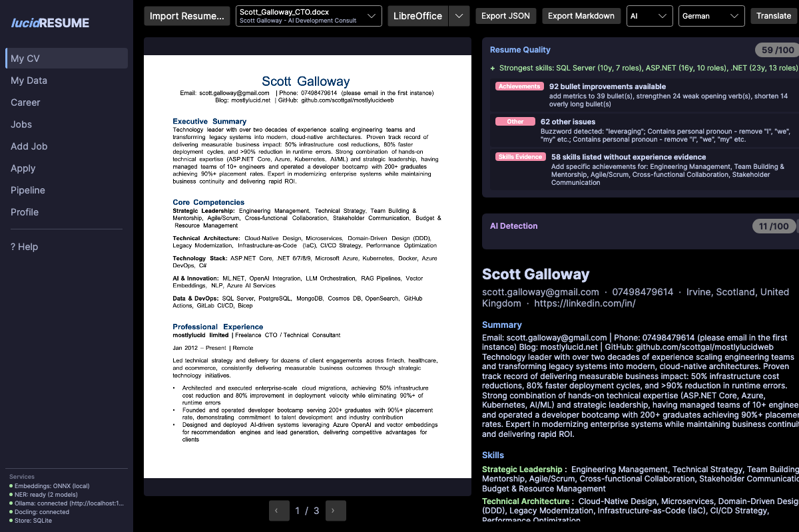
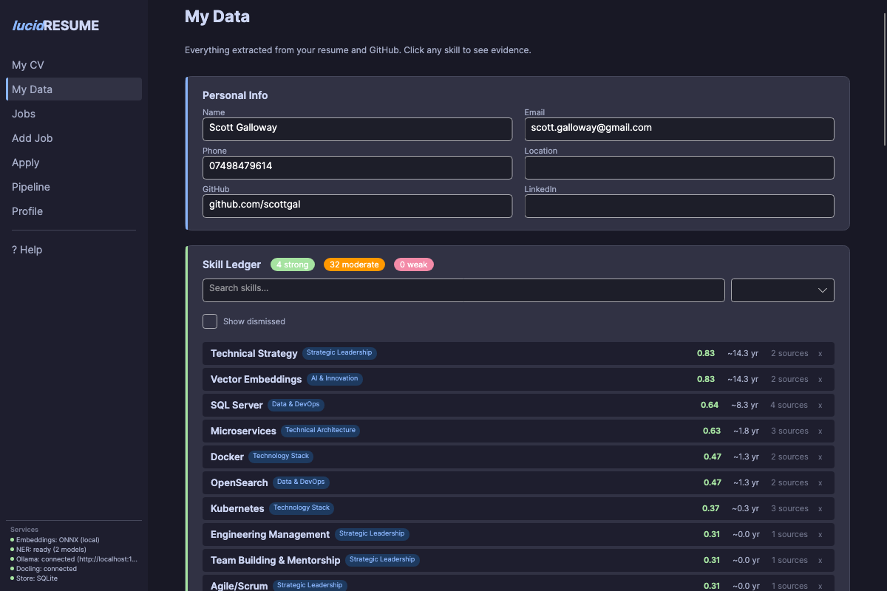
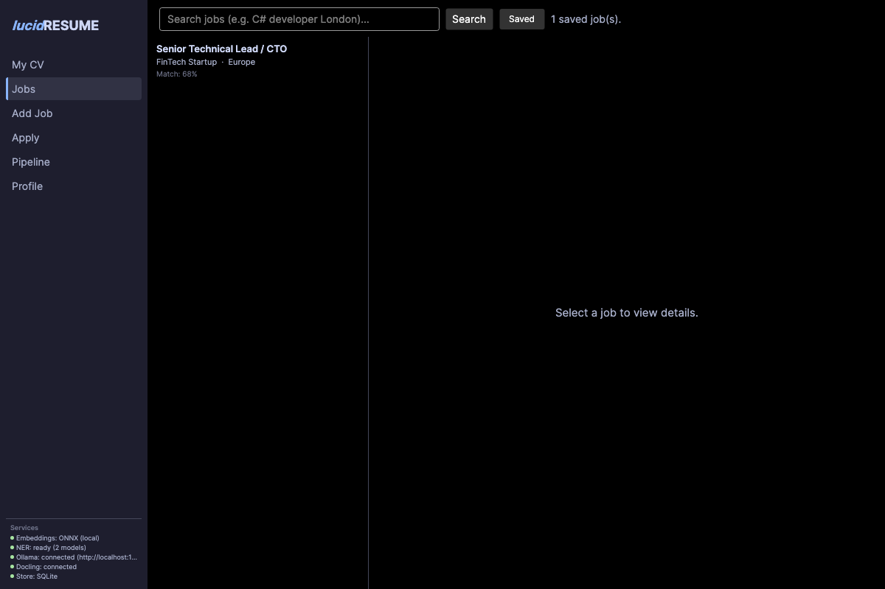
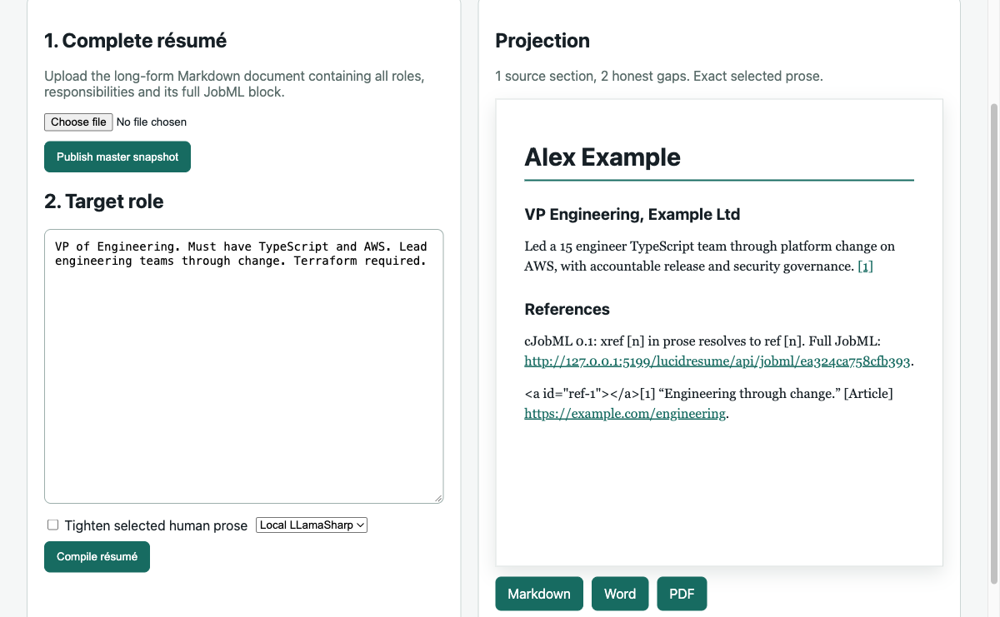
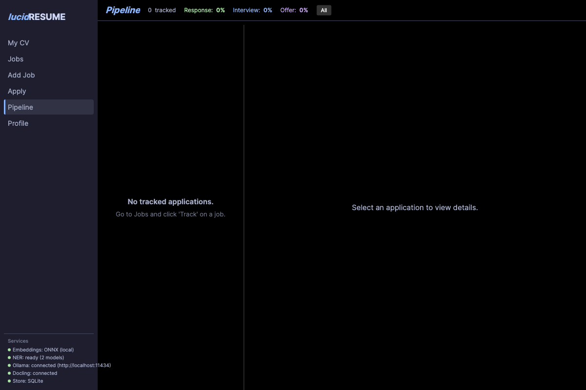

# ***lucid*RESUME**

> NOTE: lucidRESUME is a **research project** and not intended as a product for general use. 

[](https://github.com/scottgal/lucidRESUME/releases/latest)
[](https://www.nuget.org/packages/Mostlylucid.Avalonia.UITesting)
[](https://www.nuget.org/packages/Mostlylucid.Avalonia.UITesting)

**Human prose for people. Evidence-linked JobML for machines.**

***lucid*RESUME** is a free, open-source desktop editor for evidence-backed
resumes. You write and own the human prose. The app keeps a separate,
higher-resolution JobML representation for ATS and AI systems, with every
machine-facing claim linked to the evidence that supports it.

It builds a structured ledger from your resumes, LinkedIn data, repositories,
and other sources, then uses that ledger to:

- **Project role-specific resumes** from a persistent evidence ledger
- **Match you to relevant roles** with per-skill similarity scoring
- **Show what you're missing** (and what you're not)
- **Plan your next move** based on your actual skill graph

The ledger and deterministic extraction pipeline run locally on your machine. No
account is required. Data leaves your machine only when you explicitly configure
a cloud AI provider, import a remote source, or use an online job-search service.

OpenAI is the primary full-strength provider for assisted ingestion and optional
drafting. Anthropic and Ollama are also supported. grug 9B through LLamaSharp is
an experimental offline path. These providers can offer an explicitly labelled
prose draft or sample. A draft is not accepted
prose, evidence, or a published claim. The person remains the author and decides
what to edit, accept, and publish.

Projection itself is deterministic. It selects reviewed resume, LinkedIn, and
GitHub ledger records and starts with the accepted human prose. An optional,
bounded editing stage may tighten those selected passages with local grug 9B or
OpenAI. Each pass is rejected if it introduces claims, evidence IDs, numbers, or
sections outside the deterministic selection. The result exports as one
evidence-linked artifact in Markdown, Word, or PDF. Published documents use
inline numbered citations and a compact cJobML References section. Full JobML,
including drift and editing metadata, can be published at a linked endpoint.
See [the design article](https://mostlylucid.net/blog/the-problem-with-resumes).
See [resume output and template design](docs/resume-output-design.md) for the full flow,
template rationale, and configuration.

> Built with .NET 10 + Avalonia. Runs on Windows, macOS, and Linux.

---

## Core Idea

**Every skill is backed by evidence.**

***lucid*RESUME** doesn't just list what you *say* you know - it builds a **skill ledger** where each skill is tied to:

- **Where** it appeared (job, project, repo)
- **When** you used it (date ranges, calculated years)
- **How often** it shows up across roles
- **How strong** the evidence is (recency, frequency, confidence)

No invented skills. No output-time guessing. Extraction is recorded once with its
method, confidence, source, and review state.

An optional Jev decision layer can resolve bounded ingestion ambiguities after local
rules and NER have proposed candidates. It can classify an unknown section or
select an already-extracted person or employer span. It cannot generate a new
name, company, claim, or evidence value. Every decision is probability-gated,
source-hashed, and recorded for review. Jev is disabled by default because the
current service is hosted. See the [experiment and benchmark guide](docs/jev-parsing-experiment.md).
Cloud API keys entered in Profile are held by the operating system credential
store, never in the JSON settings file.

This is the foundation everything else builds on - matching, projection, gap analysis, and career direction.

The two representations have different jobs:

- Human prose is written for human readers. It should sound like its author.
- JobML is written for machines. It can be more explicit and more detailed, but
  it must remain traceable to reviewed prose or external evidence.
- AI may suggest draft prose. It cannot silently publish that prose, create
  accepted evidence, or turn an inference into fact.

lucidRESUME is not an automated job application service and it is not intended
to disguise machine-written text as human writing. Its purpose is to let human
writing remain human while giving ATS and AI systems a precise, verifiable view.

The experimental **JobML 0.1 editor** places authoritative human Markdown on the
left, editable JobML on the right, and live evidence links between them. Selecting
a link highlights both the supporting prose and machine reference. As prose
changes, claims are marked `valid`, `changed`, `missing`, or `ambiguous`;
inferred claims never become evidence without explicit acceptance. Markdown may
be shorter for a particular role while JobML retains higher-resolution external
evidence. Its default **Document** tab is a debounced live DOCX projection through
the selected output template, rendered by Morph beside those evidence links. It
does not re-extract or reinterpret the ledger. See the
[JobML specification](docs/jobml-0.1-specification.md),
[cJobML publication specification](docs/cjobml-0.1-specification.md),
[implementation profile](docs/jobml-0.1.md), and
[GitHub repository extension](docs/jobml-github-extension-0.1.md).

| | |
|---|---|
|  |  |

---

## Why ***lucid*RESUME**?

Every major job site wants your email, your browsing history, and permission to sell your profile. AI resume tools send your CV to some SaaS vendor's cloud. Paid tools charge monthly for table-stakes features.

***lucid*RESUME** does things differently:

- **Evidence-first AI** - full-strength OpenAI is the primary assisted path; [grug 9B Q4_K_M](https://huggingface.co/ProCreations/grug-9b-gguf) through LLamaSharp remains an experimental offline option. Neither path runs during deterministic projection.
- **No account required** - data stored in a local SQLite database. You own it.
- **Evidence-led projection** - Project only renders claims already present in the ledger.
- **Career direction (based on your actual skill graph)** - not just "match this job" but "what to do next to reach your target cluster".
- **Free forever** - Unlicense. Public domain.

---

## What It Does

### Resume Import


- **Drag and drop** any file onto the app to import — resumes, LinkedIn exports, anything
- Import PDF or DOCX resumes
- **DOCX preview** powered by [Morph](https://github.com/SimonCropp/Morph) — cross-platform document-to-image rendering in pure C#, no LibreOffice needed
- **LinkedIn data export** — drop your LinkedIn ZIP archive and it auto-detects and imports your full profile: positions, skills (with endorsement counts), education, projects, contact info
- **GitHub evidence** - imports Linguist language totals, topics, README-derived
  candidates, project dates, and repository provenance. Observed technologies are
  kept separate from reviewed personal claims.
- All imports merge into a **single unified candidate document** using embedding cosine similarity — no duplicates, full source tracking
- Handles two-column, LaTeX, complex formatting
- Template learning: learns your resume's structure on first parse, deterministic on subsequent imports
- Multilingual: German, French, Spanish, Portuguese, Chinese, Dutch, Japanese, Korean

### Skill Ledger


- **Provenance chain**: skill -> which job -> which date range -> which bullet point
- **Calculated years**: sum of non-overlapping date ranges where the skill appears
- **Evidence strength**: combining years, role count, recency, confidence
- **Consistency checking**: flags skills listed but never demonstrated, claimed vs calculated years
- **Presentation gap vs true gap**: "you have adjacent skills" vs "you don't have this at all"

### Smart Matching



- Multi-vector cosine similarity between resume and JD skill ledgers
- 3-layer matching: substring -> embedding similarity -> achievement-text keyword search
- Per-skill match detail with similarity scores, evidence strength, calculated years

### Career Direction
- **Skill graph** with co-occurrence edges and Leiden community detection
- **Career planner**: 4 gap types (PresentationGap, WeakEvidence, AdjacentSkill, TrueGap)
- **Effort/impact ranking**: Low (rewording), Medium (side project), High (new learning)
- **Search query generator**: suggests job searches from your strongest skill communities

### Evidence Projection
- Treats the complete 10+ page human résumé and full JobML ledger as source code
- Detects role requirements, then deterministically plans sections and selects evidence
- Semantic compression: 13 roles -> 6 relevant -> filtered to evidence-backed bullets
- Optionally runs bounded tightening and human-voice passes over selected source prose
- Renders Markdown and JobML together without output-time evidence re-inference
- Preserves human-owned prose while JobML carries explicit machine detail

### Embeddable web compiler

`lucidRESUME.Web` is an ASP.NET Core control for the narrow publish-and-compile
workflow. It does not ingest LinkedIn exports, repositories, or old CVs. That
happens upstream in the desktop application. The control accepts the already
complete Markdown + JobML master, publishes an immutable revision, accepts a job
description, and returns a shorter evidence-bounded projection with Markdown,
Word, and PDF downloads.



```csharp
builder.Services.AddLucidResumeCompiler(builder.Configuration);

var app = builder.Build();
app.UseAntiforgery();
app.MapLucidResumeCompiler();
app.Run();
```

Run the included host with:

```bash
dotnet run --project samples/lucidRESUME.Web.Sample
```

The current master is served at `/lucidresume/api/jobml`; immutable revisions are
served at `/lucidresume/api/jobml/{revision}` with ETags and long-lived cache
headers. API keys remain server-side. See the
[web compiler guide](docs/jobml-web-compiler.md).

### Personal ATS (Pipeline)



- **Stage pipeline**: Saved -> Applied -> Screening -> Interview -> Offer -> Accepted/Rejected/Withdrawn/Ghosted
- Timeline per application, funnel visualization, stale detection
- **Email integration** (IMAP via MailKit): auto-detects confirmations, interviews, rejections, offers

### Job Search
Seven job board adapters searched in parallel (Adzuna, Reed, Findwork, Arbeitnow, JoinRise, Jobicy, Remotive). Near-duplicate detection via embedding similarity. Hoover role flagging.

### Export
JSON Resume (standard schema), Markdown, **DOCX** (Word via OpenXml), and **PDF** ([QuestPDF](https://www.questpdf.com/) — professional formatting, cross-platform).

### Documentation
- [Release & Archive Guide](docs/release.md) - release workflow, platform archives, and single-page docs archive.
- [Technical Architecture](docs/architecture.md) - modules, data flow, persistence, and extraction pipeline.
- [Document Layout Detection](docs/layout-detection.md) - DocLayNet YOLO model, structural hashing, template communities.
- [Jev-assisted Parsing and Benchmarking](docs/jev-parsing-experiment.md) - bounded NER decisions, privacy, drift records, and reproducible benchmarks.
- [JobML 0.1 Specification](docs/jobml-0.1-specification.md) - normative document model, evidence reconciliation, review states, and extensions.
- [cJobML 0.1 Publication Projection](docs/cjobml-0.1-specification.md) - compact numbered citations, references, full-ledger endpoints, and one-pass parsing.
- [JobML Web Compiler](docs/jobml-web-compiler.md) - complete master publication, deterministic role projection, bounded prose editing, and ASP.NET Core integration.
- [JobML GitHub Extension](docs/jobml-github-extension-0.1.md) - repository quality, attribution, and skill-observation model.
- [In-App User Manual](src/lucidRESUME/Resources/user-manual.md) - the same help content embedded in the desktop app.

### CLI

```bash
lucidresume parse          --file cv.docx [--output result.json]
lucidresume evidence       --resume cv.docx [--output ledger.json]
lucidresume match          --resume cv.docx --job "JD text"
lucidresume compound-match --resume cv.docx --jobs-dir jds/
lucidresume explain        --resume cv.docx --job "JD text"
lucidresume tailor         --resume cv.docx --job "JD text" [--output projected.md]
lucidresume drift          --resume1 old.docx --resume2 new.docx
lucidresume export         --file cv.docx --format pdf|docx|markdown|json
lucidresume validate       --resume cv.docx
lucidresume fix            --resume cv.docx [--output fixed.md]
lucidresume generate       --resume cv.docx --prompt "draft a 2 page cloud resume"
lucidresume anonymize      --resume cv.docx [--output anon.json]
lucidresume rank           --dir resumes/ --job "JD text"
lucidresume search         --prompt "senior .NET developer remote"
lucidresume extract-jd     --job "JD text" [--output jd.json]
lucidresume github-import  --username scottgal
lucidresume batch-test     --dir resumes/
lucidresume jobml validate  --file resume.jobml.md
lucidresume jobml reconcile --file resume.jobml.md
lucidresume jobml coverage  --file resume.jobml.md
lucidresume jobml cold-parser-probe --file resume.jobml.md
lucidresume jobml compact --file resume.jobml.md --complete-ledger https://example.net/resume.jobml --output resume.md
lucidresume jobml link-post --file resume.jobml.md --claim claim-id --url https://example.net/article --output linked.jobml.md
```

Role projections include compact cJobML citations in Markdown, Word, and PDF by
default. Pass `--cjobml false` to `tailor`, `generate`, or `render` for a
human-only copy. Compact references can cite imported résumé sources and public
evidence without copying full passages, selectors, or drift hashes out of the
complete ledger.

---

## Getting Started

### Download & Install

1. Go to the [latest release](https://github.com/scottgal/lucidRESUME/releases/latest)
2. Download the archive for your platform:

| Platform | Download |
|----------|----------|
| **Windows** | `lucidRESUME-...-win-x64.zip` or `win-arm64.zip` |
| **macOS** | `lucidRESUME-...-osx-arm64.tar.gz` (Apple Silicon) or `osx-x64.tar.gz` (Intel) |
| **Linux** | `lucidRESUME-...-linux-x64.tar.gz` or `linux-arm64.tar.gz` |

3. Extract the archive. On macOS, open `lucidRESUME.app`. On Windows or Linux,
   run `lucidRESUME.exe` or `lucidRESUME` respectively.

The desktop app downloads its local ONNX models (about 600 MB) on first launch.
They are cached in the user data directory, outside the signed application bundle.
No account or setup wizard is required.

> **macOS users:** the bundle is ad-hoc signed but not notarized. If Gatekeeper blocks it, Control-click the extracted app and choose Open. If needed, run `xattr -dr com.apple.quarantine ./lucidRESUME.app` on that app only.

### AI-assisted ingestion and drafts (Optional)

AI assistance is optional. It can recover structured candidates from difficult
source documents or offer a clearly labelled authoring draft. Every inferred
record is stored with provenance and requires review. Draft prose remains
unaccepted until a person edits and approves it. Resume projection and export
work without a language model.

**Option 1: OpenAI (primary full-strength provider)**
1. Open **Profile → AI Provider**
2. Enter your OpenAI API key and select `openai`
3. Select the model and save. The key is stored in the operating system credential store.

**Option 2: Local AI with LLamaSharp (experimental)**
1. Open **Profile → AI Provider**
2. Select `llamasharp` and click **Download local model**
3. Restart the app after the 5.63 GB Q4_K_M download completes

The model is loaded lazily and uses its embedded chat template. Apple Silicon uses the Metal support included in the LLamaSharp CPU backend; other platforms have a portable CPU fallback. Set `LlamaSharp:ModelPath`, `ContextSize`, or `GpuLayerCount` in `lucidresume.json` to override the defaults. Relative model paths resolve under the user data directory, outside the signed application bundle.

**Option 3: Local AI with [Ollama](https://ollama.ai)**
1. Install Ollama and run `ollama pull qwen3.5:4b`
2. Select `ollama` under **Profile → AI Provider**

**Option 4: Anthropic**
1. Open the **Profile** page in the app
2. Enter your Anthropic API key and select `anthropic`

### Build from Source

For developers who want to build from source:

```bash
git clone https://github.com/scottgal/lucidRESUME
cd lucidRESUME
dotnet run --project src/lucidRESUME/lucidRESUME.csproj
```

Requires [.NET 10 SDK](https://dotnet.microsoft.com/download). The default solution is desktop-only, so `dotnet build lucidRESUME.sln` and `dotnet test lucidRESUME.sln` do not require mobile workloads. See [docs/release.md](docs/release.md) for the release workflow.

---

## How It Works (Technical)

### Extraction

**5-layer RRF fusion** for both resume and JD extraction: structural patterns + ONNX NER (2 models) + **skill taxonomy centroids** (19,983 skills from 1.3M LinkedIn jobs) + optional LLM candidate extraction + **entity lookup** (11K companies, 7K locations). All signals run during ingestion and are fused by reciprocal rank fusion with multi-source confidence boosting. The resulting evidence records are persisted with provenance and review state.

Export is deliberately less clever. It is a projection of accepted ledger records.
It does not rerun NER or an LLM, and it refuses stale evidence. This keeps the
human prose and the JobML evidence graph reversible: each rendered claim points
back to the exact ingested evidence and source revision that justified it.

**Skill taxonomy**: 19,983 preprocessed entries from the documented Kaggle/LinkedIn datasets ship with the application, together with priority data and compact leadership profiles for Lead Developer, Head of Engineering, CTO and VP Engineering. These source terms are the reproducible seeds for exact matching and locally materialised role centroids. No personal résumé, ledger or user database is part of the preload. Used by both resume and JD parsers to find skills embedded in prose.

The exact clean-install boundary, dataset provenance and release audit are documented in [Product data and clean-install contract](docs/product-assets.md).

ONNX embeddings (`all-MiniLM-L6-v2`, 384-dim) power semantic matching throughout. **[DocLayNet YOLO model](docs/layout-detection.md)** detects document structure from rendered page images — titles, section headers, tables, lists — producing a structural hash for template identification. Docling (Docker) adds ML-based PDF layout detection for complex documents; PdfPig with column detection as local fallback.

### Architecture

```
lucidRESUME (Avalonia UI: My CV, JobML Editor, My Data, Career, Jobs, Add Job, Project, Pipeline, Profile, Help)
    ├── Ingestion        Resume parsing, DocLayNet layout detection, Morph preview, LinkedIn import
    ├── Extraction       ONNX NER (2 models) + Microsoft.Recognizers pipeline
    ├── Parsing          DOCX/PDF/TXT extraction, ATS pattern detection, template learning
    ├── JobSpec          JD parsing (5-layer RRF: Structural + NER + Taxonomy + LLM + Entity), URL scraping
    ├── JobSearch        7 job board adapters + orchestrator + deduplicator
    ├── Matching         Skill ledger, skill graph, career planner, taxonomy centroids, entity lookup
    ├── AI               LLamaSharp/Ollama/Anthropic/OpenAI ingestion and draft-authoring providers
    ├── Compiler         Complete JobML master -> deterministic role-specific projection
    ├── Web              Embeddable ASP.NET Core publish, preview, and export control
    ├── EmailTracker     IMAP scanning, email classification, application matching
    ├── Export           JSON Resume + Markdown + DOCX + PDF exporters
    ├── Collabora        LibreOffice/editor integration, document openers
    ├── UXTesting        UI automation framework (REPL, MCP, script runner)
    └── Core             Domain models, interfaces, persistence (SQLite + sqlite-vec)
```

**Dependency rule:** everything depends inward on `Core`. `Core` depends only on `Microsoft.Data.Sqlite` and `sqlite-vec`.

### Key Design Patterns

| Pattern | Where | Why |
|---------|-------|-----|
| **5-Layer RRF Fusion** | Resume + JD extraction | Structural + NER + Taxonomy + LLM + Entity Lookup vote, best candidate wins |
| **Skill Taxonomy** | Matching module | 19,983 skills from 1.3M LinkedIn jobs — cross-industry, not just tech |
| **Entity Lookup** | JD parser | 11K companies + 7K locations from LinkedIn/Adzuna validate NER candidates |
| **Skill Ledger** | Matching module | Every skill backed by evidence with provenance |
| **Skill Graph + Communities** | Career planner | Leiden community detection with UMAP visualisation |
| **Template Learning** | DOCX parser | First parse learns structure, subsequent parses are deterministic |
| **ATS Pattern Detection** | PDF parser | YAML rulesets identify resume templates/ATS systems |

---

## Tests

```bash
dotnet test lucidRESUME.sln    # 388 tests across 12 projects
```

| Project | Tests | Coverage |
|---------|-------|----------|
| Core.Tests | 77 | Persistence, models, multi-resume, export, linked posts |
| Extraction.Tests | 24 | NER, recognizers, RRF fusion pipeline |
| AI.Tests | 34 | Providers, embeddings, bounded decisions, deterministic projection, gated live OpenAI checks |
| Matching.Tests | 58 | Skill scoring, filters, voting, projection quality |
| JobSpec.Tests | 8 | JD parsing, salary extraction |
| EmailTracker.Tests | 25 | Classifier, matcher |
| GitHub.Tests | 26 | Language map, LinkedIn parser, document merger |
| JobML.Tests | 27 | Parsing, validation, drift, reversible links, cJobML projection |
| Compiler.Tests | 6 | Deterministic evidence selection and projection orchestration |
| Web.Tests | 3 | ASP.NET Core endpoint and projection control |
| App.Tests | 2 | Native operating-system credential storage |
| Avalonia.UITesting.Tests | 98 | Input, scripts, locators, screenshots, REPL |

---

## UX Testing

[](https://www.nuget.org/packages/Mostlylucid.Avalonia.UITesting)
[](https://www.nuget.org/packages/Mostlylucid.Avalonia.UITesting)

The UI automation layer is published as a standalone NuGet package — **[Mostlylucid.Avalonia.UITesting](https://www.nuget.org/packages/Mostlylucid.Avalonia.UITesting)** — so any Avalonia desktop app can use it. Real pointer/touch/wheel/gesture input via Avalonia's `IInputManager`, region/control snipping for manuals, YAML scripts, GIF video, REPL, and an MCP server. Source lives in [`src/Mostlylucid.Avalonia.UITesting/`](src/Mostlylucid.Avalonia.UITesting/README.md).

```bash
# Run a YAML test script
dotnet run --project src/lucidRESUME/lucidRESUME.csproj -- \
  --ux-test --script ux-scripts/e2e-full-flow.yaml --output ux-screenshots

# Interactive REPL
dotnet run --project src/lucidRESUME/lucidRESUME.csproj -- --ux-repl

# MCP server (for LLM-driven UI control)
dotnet run --project src/lucidRESUME/lucidRESUME.csproj -- --ux-mcp
```

---

## Roadmap

- [x] Optional resume authoring drafts and suggestions, always subject to human review
- [x] Automated job polling from skill community search queries
- [x] Resume extraction RRF fusion (multi-source confidence boost, same pattern as JD)
- [x] Career planner UI page with gap analysis visualization
- [x] Leiden community detection (refinement phase over Louvain greedy moves)
- [x] Temporal skill drift across resume variants (compare ledgers, detect added/dropped/changed skills)
- [x] DOCX export of projected resumes (pure C# via OpenXml, cross-platform)
- [x] PDF export of projected resumes (QuestPDF, professional formatting)
- [x] LinkedIn data export import (ZIP archive with full profile)
- [x] GitHub repo skills import (languages, topics, README analysis via lucidRAG)
- [x] DocLayNet ONNX model for document layout detection (YOLOv10m, 58MB, structural hashing)
- [x] RRF fusion name extraction (NER + positional + heading + email + LLM backstop — 92% accuracy)
- [x] Full CLI toolkit (17 commands: parse, evidence, match, explain, tailor, rank, fix, generate, etc.)
- [x] Batch testing and quality evaluation across 26 multilingual resumes
- [x] Skill taxonomy centroids (19,983 skills from 1.3M LinkedIn jobs + Kaggle role archetypes)
- [x] Entity lookup (11K companies, 7K locations, 144 industries from LinkedIn/Adzuna via DuckDB)
- [x] 5-layer JD parser (Structural + NER + Taxonomy + LLM + Entity — 0→60+ skills from plain text)

---

## Contributing

PRs welcome. Run the tests before submitting:

```bash
dotnet test
```

The codebase follows a strict inward dependency rule - keep domain logic in `Core` and wire everything in the app shell.

---

## License

This is free and unencumbered software released into the public domain.
See [LICENSE](LICENSE) or [unlicense.org](https://unlicense.org) for details.

**No strings attached. No attribution required. Use it however you like.**
